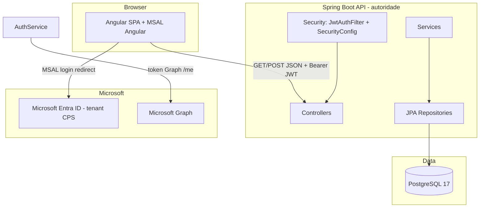
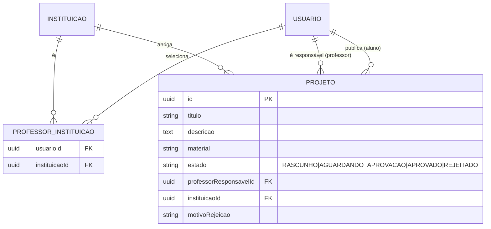

# Architecture Spine — Fatec-Repositorios

## Design Paradigm

Camadas com **back-end autoritativo**: o front-end Angular (SPA) consome a API REST Spring Boot; todo estado e toda decisão de segurança vivem no servidor. O front é uma "pele" — envia tokens, recebe respostas, nunca decide papel nem regra.



## Invariants & Rules

### AD-1 — O back-end é a autoridade de segurança e de papel

- **Binds:** CAP-1, CAP-2, all
- **Prevents:** front-end (ou bibliotecas de terceiros) decidirem autenticação/autorização; papel vindo de `localStorage` usado em decisão de segurança
- **Rule:** Spring Security valida o JWT de sessão (HMAC assinado pelo próprio back-end via `JwtTokenProvider`) em toda requisição; o papel é lido do token JWT emitido pelo servidor e reaplicado nas autorizações (`@PreAuthorize`/`hasAnyRole`). O front usa papel apenas para renderização de UI.

### AD-2 — Papel é derivado no login pela regra de domínio (UPN)

- **Binds:** CAP-2
- **Prevents:** dois builders persistindo papéis contraditórios; lista manual de professores corporificando regra divergente do domínio
- **Rule:** ao receber o token do Graph em `POST /auth/login-microsoft`, o back-end consulta `GET graph.microsoft.com/v1.0/me` e classifica pelo `userPrincipalName`/`mail`, **nesta ordem**: (1) termina em `@aluno.cps.sp.gov.br` → `ALUNO`; (2) termina em `@cps.sp.gov.br` → `PROFESSOR`; (3) qualquer outro mailbox do tenant → `ALUNO` (fallback). `UserRole` passa a ser `ADMIN | ALUNO | PROFESSOR` (GESTOR removido). O papel é recalculado a cada login e persistido apenas como cache de conveniência.

### AD-3 — MSAL e back-end restritos ao tenant único da CPS

- **Binds:** CAP-1
- **Prevents:** contas de fora do tenant logando como aluno (caso o login fosse aberto a qualquer conta Microsoft)
- **Rule:** `authority` do MSAL fixado no tenant GUID da CPS (já presente no `docker-compose`); o app registration rejeita outros tenants; contas fora do tenant não completam login no Graph e o back-end responde 401.

### AD-4 — Vínculo professor↔instituição limitado a 4, reforçado no servidor

- **Binds:** CAP-3 (NFR3)
- **Prevents:** um professor selecionar todas as instituições e concentrar o sistema
- **Rule:** join table `professor_instituicao` com no máximo 4 linhas por professor; a tentativa de 5º vínculo falha com `409`/`400` e mensagem clara. O servidor é quem valida — o front apenas exibe o erro.

### AD-5 — Instituições são dado de catálogo; só admin muta

- **Binds:** CAP-3 (NFR4, FR7)
- **Prevents:** cadastro de instituição em texto livre por professor ou aluno
- **Rule:** escrita em `/instituicoes` exige papel `ADMIN` (`hasRole("ADMIN")` no `SecurityConfig` — o `GESTOR` é removido do matcher); leitura é liberada para autenticados. Professor nunca cria instituição.

### AD-6 — Projeto nasce com professor responsável obrigatório

- **Binds:** CAP-4 (FR9)
- **Prevents:** projeto "solto para a instituição" sem dono
- **Rule:** `Projeto.professorResponsavelId` NOT NULL na criação; endpoint de postagem rejeita payload sem professor responsável; persistência garante a invariante.

### AD-7 — Ciclo de vida do projeto é uma máquina de estados

- **Binds:** CAP-4, CAP-5 (FR10, FR11)
- **Prevents:** cada trecho de código transicionando estado do projeto à sua maneira (ex.: orfanar projeto, aprovar fora de fluxo)
- **Rule:** estados `RASCUNHO → AGUARDANDO_APROVACAO → APROVADO | REJEITADO`. Postar publica de `RASCUNHO` para `AGUARDANDO_APROVACAO`; somente professor vinculado à instituição do projeto transiciona para `APROVADO`/`REJEITADO`; rejeição exige `motivo`; `ADMIN` não aprova.

## Consistency Conventions

| Concern | Convention |
| --- | --- |
| Naming (entidades, arquivos, endpoints) | Domínio em português (seguindo código atual: `Usuario`, `Projeto`, `Instituicao`); endpoints REST em português plural (`/auth`, `/instituicoes`, `/projetos`); DTOs com sufixos `*Request`/`*Response` |
| Data & formats | PK UUID (`GenerationType.UUID`); timestamps `criadoEm`/`atualizadoEm` `LocalDateTime`; envelope de erro `{"codigo": <http>, "mensagem": "..."}` via `GlobalExceptionHandler`; claim JWT `role` = nome do enum |
| Auth & segurança | JWT stateless, header `Authorization: Bearer <jwt>`; papel validado no servidor; estados do projeto via enum próprio; CORS apenas origens locais conhecidas |

## Stack

| Name | Version |
| --- | --- |
| Java | 21 |
| Spring Boot | 4.1.0 |
| auth0 java-jwt | 4.4.0 |
| auth0 jwks-rsa | 0.22.0 |
| springdoc-openapi (starter webmvc ui) | 3.0.2 |
| PostgreSQL | 17 (alpine, container) |
| Angular | 21 |
| @azure/msal-angular | 5.3.1 |
| @azure/msal-browser | 5.16.0 |
| Orquestração | docker-compose (postgres:5432, backend:4040, frontend:4200) |

## Structural Seed

```text
back-end/src/main/java/com/fatecrepository/
  controller/     # AuthController, InstituicaoController, ProjetoController
  service/        # AuthService (classificação), MicrosoftGraphService, InstituicaoService, ProjetoService
  model/          # User (roles ADMIN/ALUNO/PROFESSOR), Instituicao, Projeto, ProfessorInstituicao (join) — GESTOR removido
  dto/request/    # MicrosoftLoginRequest, InstituicaoRequest, ProjetoRequest
  dto/response/   # AuthResponse, InstituicaoResponse, ProjetoResponse
  repository/     # UserRepository, InstituicaoRepository, ProjetoRepository, ProfessorInstituicaoRepository
  security/       # SecurityConfig, JwtTokenProvider, JwtAuthenticationFilter, CustomUserDetailsService
front-end/src/app/
  core/auth/      # AuthService (MSAL + /auth/login-microsoft), guards por papel
  features/       # pagina-inicial, upload-projeto, ver-projeto, admin/*, login-msal (login-instituicao/monarch removed)
  shared/         # card-projeto, header, footer, microsoft-login-button, diretiva button
```



## Capability → Architecture Map

| Capability / Area | Lives in | Governed by |
| --- | --- | --- |
| CAP-1 Login MSAL tenant CPS | SPA (MSAL Angular) + `POST /auth/login-microsoft` | AD-1, AD-3, Convenção auth |
| CAP-2 Classificação por domínio | `AuthService` (Graph `/me` + regra de domínio) | AD-2 |
| CAP-3 Seleção 1–4 instituições | `ProfessorInstituicao` (join) + `/instituicoes` | AD-4, AD-5 |
| CAP-4 Postagem com responsável | `ProjetoController`/`ProjetoService` | AD-6, AD-7 |
| CAP-5 Aprovação de projetos | `ProjetoService` (transição de estado) | AD-7 |

## Deferred

- Emitente exato da aprovação (somente professor responsável — recomendado — vs. qualquer professor da instituição): decisão de negócio em aberto (PRD §8); AD-7 registra "professor vinculado à instituição" como mínimo seguro.
- Dono da moderação/disputas (projeto indevido, vinculação errada): hoje "ninguém" — decisão consciente.
- Provisionamento do admin (mecanismo de criação da primeira conta ADMIN): `back-end/init/01-create-admin.sql` já existe (seed); política formal fica para implementação.
- Armazenamento da foto de perfil (base64 via Graph vs. arquivo/URL): hoje `data:image/jpeg;base64` — reavaliar se virar requisito de storage.
- Paginação e busca na listagem de projetos; portfólio público para não autenticados: não decididos.