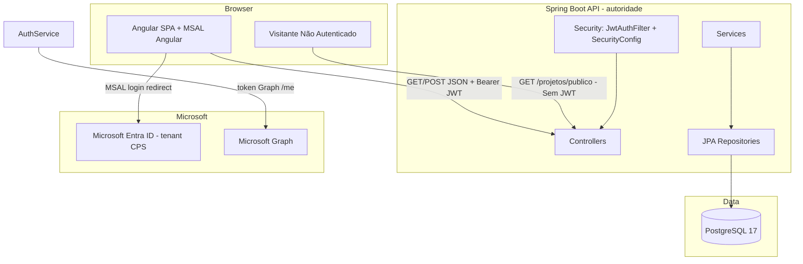
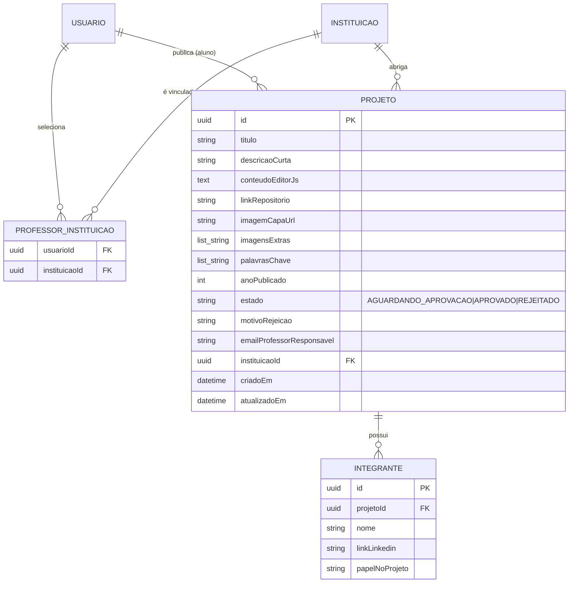

# Architecture Spine — Fatec-Repositorios

## Design Paradigm

Camadas com **back-end autoritativo**: o front-end Angular (SPA) consome a API REST Spring Boot; todo estado e toda decisão de segurança vivem no servidor. O catálogo público de projetos no estado `APROVADO` é acessível para visitantes sem autenticação, enquanto postagem e aprovação exigem tokens JWT emitidos após login MSAL.



## Invariants & Rules

### AD-1 — O back-end é a autoridade de segurança e de papel

- **Binds:** CAP-1, CAP-2, all
- **Prevents:** front-end (ou bibliotecas de terceiros) decidirem autenticação/autorização; papel vindo de `localStorage` usado em decisão de segurança
- **Rule:** Spring Security valida o JWT de sessão (HMAC assinado pelo próprio back-end via `JwtTokenProvider`) em toda requisição protegida; o papel é lido do token JWT emitido pelo servidor e reaplicado nas autorizações (`@PreAuthorize`/`hasAnyRole`). O front usa papel apenas para renderização de UI.

### AD-2 — Papel é derivado no login pela regra de domínio (UPN)

- **Binds:** CAP-2
- **Prevents:** dois builders persistindo papéis contraditórios; lista manual de professores corporificando regra divergente do domínio
- **Rule:** ao receber o token do Graph em `POST /auth/login-microsoft`, o back-end consulta `GET graph.microsoft.com/v1.0/me` e classifica pelo `userPrincipalName`/`mail`, **nesta ordem**: (1) termina em `@aluno.cps.sp.gov.br` → `ALUNO`; (2) termina em `@cps.sp.gov.br` → `PROFESSOR`; (3) qualquer outro mailbox do tenant → `ALUNO` (fallback). `UserRole` é `ADMIN | ALUNO | PROFESSOR`. O papel é recalculado a cada login e persistido como cache de conveniência.

### AD-3 — MSAL e back-end restritos ao tenant único da CPS

- **Binds:** CAP-1
- **Prevents:** contas de fora do tenant logando na aplicação
- **Rule:** `authority` do MSAL fixado no tenant GUID da CPS; o app registration rejeita outros tenants; contas fora do tenant não completam login no Graph e o back-end responde 401.

### AD-4 — Vínculo professor↔instituição flexível (0 a 4), reforçado no servidor

- **Binds:** CAP-3
- **Prevents:** um professor selecionar mais de 4 instituições; vínculo obrigatório no primeiro login bloqueando o acesso
- **Rule:** join table `professor_instituicao` com no mínimo 0 e no máximo 4 linhas por professor. A seleção não é obrigatória no onboarding e pode ser feita ou alterada a qualquer momento. A tentativa de 5º vínculo falha com `400/409` e mensagem clara.

### AD-5 — Instituições são dado de catálogo; só admin muta

- **Binds:** CAP-3
- **Prevents:** cadastro de instituição em texto livre por professor ou aluno
- **Rule:** escrita em `/instituicoes` exige papel `ADMIN` (`hasRole("ADMIN")`); leitura é liberada para autenticados. Professor nunca cria instituição.

### AD-6 — Projeto persiste e-mail do professor responsável com autocomplete no front-end

- **Binds:** CAP-4
- **Prevents:** projeto persistido sem e-mail do professor responsável
- **Rule:** `Projeto.emailProfessorResponsavel` (string) é obrigatório na criação. O front-end provê autocomplete listando e-mails de professores cadastrados no tenant, mas o back-end valida e persiste a string do e-mail no atributo.

### AD-7 — Ciclo de vida do projeto é uma máquina de estados sem RASCUNHO

- **Binds:** CAP-4, CAP-5
- **Prevents:** projetos criados como rascunho sem submissão; transições inválidas
- **Rule:** o projeto nasce diretamente como `AGUARDANDO_APROVACAO`. Transições possíveis: `AGUARDANDO_APROVACAO → APROVADO | REJEITADO`. No estado `REJEITADO`, o campo `motivoRejeicao` é **obrigatório (NOT NULL)**.

### AD-8 — Entidade Integrante vinculada ao Projeto (1 ── N)

- **Binds:** CAP-6
- **Prevents:** projetos sem identificação dos integrantes ou dados formatados de maneira solta
- **Rule:** a entidade `Integrante` é identificada por UUID próprio, associada via FK `projetoId` e contém `nome` (string), `linkLinkedin` (string) e `papelNoProjeto` (string).

### AD-9 — Acesso público sem JWT para consulta de projetos APROVADOS

- **Binds:** CAP-7
- **Prevents:** necessidade de login para visitantes consultarem a vitrine pública de trabalhos da Fatec
- **Rule:** endpoints `/api/projetos/publico` (busca/listagem) e `/api/projetos/publico/{id}` (detalhes) são configurados como `permitAll()` no `SecurityConfig`, filtrando exclusivamente projetos com `estado = APROVADO`.

## Consistency Conventions

| Concern | Convention |
| --- | --- |
| Naming | Domínio em português (`Usuario`, `Projeto`, `Integrante`, `Instituicao`); endpoints REST em português plural (`/auth`, `/instituicoes`, `/projetos`, `/projetos/publico`); DTOs com sufixos `*Request`/`*Response` |
| Data & formats | PK UUID (`GenerationType.UUID`); timestamps `criadoEm`/`atualizadoEm` (`LocalDateTime`); envelope de erro `{"codigo": <http>, "mensagem": "..."}`; claim JWT `role` = nome do enum |
| Auth & segurança | JWT stateless para rotas protegidas; permitAll em `/projetos/publico`; papel validado no servidor; máquina de estados via Enum próprio (`ProjetoEstado`) |

## Stack

| Name | Version |
| --- | --- |
| Java | 21 |
| Spring Boot | 4.1.0 |
| auth0 java-jwt | 4.4.0 |
| auth0 jwks-rsa | 0.22.0 |
| springdoc-openapi | 3.0.2 |
| PostgreSQL | 17 (alpine, container) |
| Angular | 21 |
| @azure/msal-angular | 5.3.1 |
| @azure/msal-browser | 5.16.0 |
| Orquestração | docker-compose |

## Structural Seed

```text
back-end/src/main/java/com/fatecrepository/
  controller/     # AuthController, InstituicaoController, ProjetoController, ProjetoPublicoController
  service/        # AuthService, MicrosoftGraphService, InstituicaoService, ProjetoService
  model/          # User (roles ADMIN/ALUNO/PROFESSOR), Instituicao, Projeto, Integrante, ProfessorInstituicao (join)
  dto/request/    # MicrosoftLoginRequest, InstituicaoRequest, ProjetoRequest, IntegranteRequest
  dto/response/   # AuthResponse, InstituicaoResponse, ProjetoResponse, IntegranteResponse
  repository/     # UserRepository, InstituicaoRepository, ProjetoRepository, IntegranteRepository, ProfessorInstituicaoRepository
  security/       # SecurityConfig, JwtTokenProvider, JwtAuthenticationFilter, CustomUserDetailsService
front-end/src/app/
  core/auth/      # AuthService (MSAL + /auth/login-microsoft), guards por papel
  features/       # catalogo-publico, upload-projeto, ver-projeto, area-professor, admin/*
  shared/         # card-projeto, header, footer, autocomplete-professor, editor-js
```



## Capability → Architecture Map

| Capability / Area | Lives in | Governed by |
| --- | --- | --- |
| CAP-1 Login MSAL tenant CPS | SPA (MSAL Angular) + `POST /auth/login-microsoft` | AD-1, AD-3 |
| CAP-2 Classificação por domínio | `AuthService` (Graph `/me` + regra de domínio) | AD-2 |
| CAP-3 Seleção 0–4 instituições | `ProfessorInstituicao` (join) + `/instituicoes` | AD-4, AD-5 |
| CAP-4 Postagem com responsável e integrantes | `ProjetoController`/`ProjetoService` | AD-6, AD-7, AD-8 |
| CAP-5 Aprovação de projetos | `ProjetoService` (transição de estado) | AD-7 |
| CAP-6 Entidade Integrante | `IntegranteRepository`/`ProjetoService` | AD-8 |
| CAP-7 Catálogo público para visitantes | `ProjetoPublicoController`/`SecurityConfig` | AD-9 |